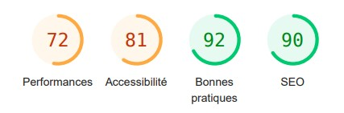
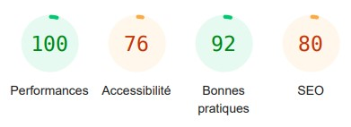
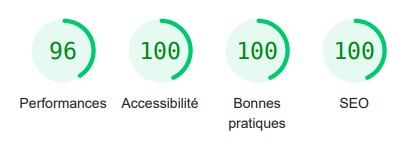
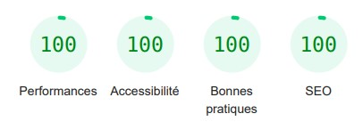

# Optimisation du site Chouette Agence

Suite à la réunion avec Sophie, nous avons décidé d'améliorer le référencement du site de l'agence dans le but de relancer notre activité.

J'ai donc analysé le site dans le but d'identifier 10 points d'améliorations selon 3 axes:
- règle SEO (référencement)
- l'accessibilité
- la sécurité

Des actions ont été effectués en suivant ces 10 recommandations, voici le comparatif des statistiques (le site actuel puis le site optimisé):

  
Non optimisé

  Page d'acceuil:

  

  Page contact:

  

  
Optimisé

  Page d'acceuil:

  

  Page contact:

  

## Voici les différentes actions effectuées.

SEO:
- optimiser le formats des images.
- améliorer la websemantic.
- minifier et compresser le code.
- supprimer les mauvaises/anciennes pratiques du code html.
- limiter les chaines de requêtes critiques.

Accessibilité:
- forcer la visibilité du texte.
- augmenter le contraste entre le texte et le background.
- nommer les liens (label).

Sécurité:
- ne plus utiliser de packages vulnérables.
- ajout des CSP (content security policy).

  
optimiser le formats des images.

  Convertion systématique des images au format webp.

